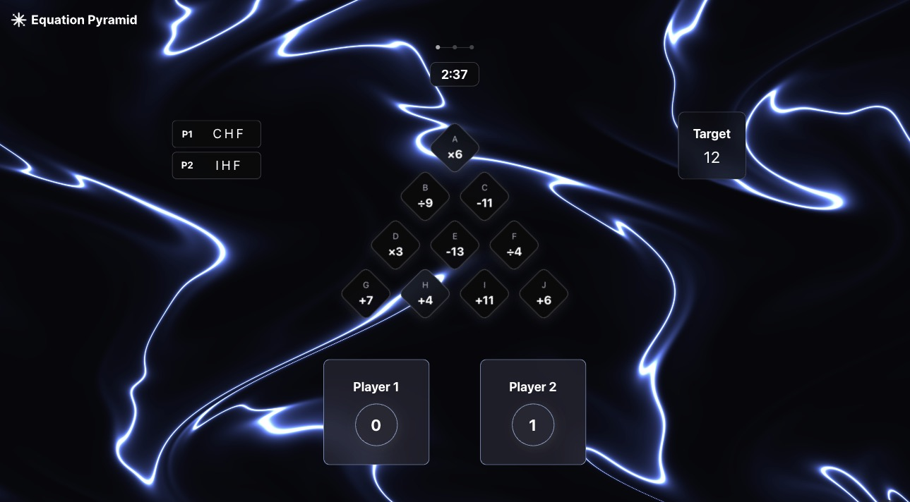

# 🎯 Equation Pyramid

<div align="center">



**A challenging math puzzle game inspired by The Devil's Plan Season 2**

[🎮 Play Now](https://equation-pyramid.carolhsiao.com) | [📖 How to Play](#how-to-play) | [🚀 Features](#features) | [💻 Development](#development)

[](https://nextjs.org/)
[](https://react.dev/)
[](https://www.typescriptlang.org/)
[](https://tailwindcss.com/)

</div>

## 🎯 About

**Equation Pyramid** is an addictive math puzzle game where players use number tiles to form equations and reach target values. Perfect for brain training, mental math practice, and competitive fun with friends!

### 🎮 Play the Game

Visit the live game at: **[https://equation-pyramid.carolhsiao.com](https://equation-pyramid.carolhsiao.com)**

## 🎲 How to Play

1. **Select Tiles**: Choose 3 tiles from the pyramid to form an equation
2. **Form Equations**: Tiles are evaluated left-to-right following mathematical order of operations
3. **Reach the Target**: Create equations that equal the target number shown
4. **Score Points**: 
   - ✅ **+1 point** for each correct equation
   - ❌ **-1 point** for incorrect equations, duplicates, or timeouts
5. **Beat the Clock**: Complete each round before time runs out!

## ✨ Features

- 🎯 **Challenging Gameplay**: Test your mental math skills with increasingly complex puzzles
- 👥 **Multiplayer Support**: Play solo or compete with friends in two teams
- 🎵 **Immersive Audio**: Background music and sound effects enhance the experience
- 🌟 **Beautiful Animations**: Smooth transitions and celebratory effects
- 📱 **Responsive Design**: Works perfectly on desktop, tablet, and mobile
- 🎨 **WebGL Backgrounds**: Dynamic shader effects create an engaging atmosphere
- 🏆 **Score Tracking**: Compete for the highest score across multiple rounds

## 🛠️ Tech Stack

- **Frontend**: Next.js 15.3.2, React 19, TypeScript
- **Styling**: Tailwind CSS v4
- **State Management**: Zustand with Immer
- **Animation**: GSAP, Framer Motion
- **3D Graphics**: Three.js / React Three Fiber
- **Audio**: Custom React hooks for sound management
- **Testing**: Jest, Storybook
- **Development**: pnpm, Biome (linting)

## 💻 Development

### Prerequisites

- Node.js 22+
- pnpm

### Installation

```bash
# Clone the repository
git clone https://github.com/carolhsiaoo/equation-pyramid.git

# Navigate to project directory
cd equation-pyramid

# Install dependencies
pnpm install

# Start development server
pnpm dev
```

### Available Scripts

```bash
pnpm dev          # Start development server with Turbopack
pnpm build        # Build for production
pnpm start        # Start production server
pnpm lint         # Run Biome linter
pnpm lint:fix     # Auto-fix linting issues
pnpm test         # Run tests
pnpm test:watch   # Run tests in watch mode
pnpm test:coverage # Generate coverage report
pnpm storybook    # Start Storybook
```

### Project Structure

```
equation-pyramid/
├── src/
│   ├── app/              # Next.js app directory
│   ├── components/       # Reusable UI components
│   ├── views/           # Game state views
│   ├── logic/           # Game logic and state management
│   ├── hooks/           # Custom React hooks
│   └── styles/          # Global styles
├── public/              # Static assets
├── docs/                # Documentation
└── __tests__/          # Test files
```

## 🎮 Game Architecture

The game follows a state machine pattern:

```
Menu → Config → Game → Guessing → ShowingResult → RoundOver → GameOver
```

- **State Management**: Zustand store with Immer for immutable updates
- **Game Logic**: Pure functions for equation validation and scoring
- **Audio System**: Custom hooks manage background music and sound effects
- **Visual Effects**: WebGL shaders, GSAP animations, and particle effects

## 👥 Contributors

<div align="center">
<table>
  <tr>
    <td align="center">
      <a href="https://www.carolhsiao.com">
        <br />
        <sub><b>Carol Hsiao</b></sub>
      </a><br />
      <div style="display: flex; justify-content: center; gap: 8px; margin-top: 8px;">
        <a href="https://www.carolhsiao.com" title="Website">
          
        </a>
        <a href="https://github.com/carolhsiaoo" title="GitHub">
          
        </a>
        <a href="https://www.linkedin.com/in/carol-hsiao-5779a1158/" title="LinkedIn">
          
        </a>
        <a href="https://x.com/CarolXiaoo" title="X (Twitter)">
          
        </a>
      </div>
    </td>
    <td align="center">
      <a href="https://easonchang.com">
        <br />
        <sub><b>Eason Chang</b></sub>
      </a><br />
      <div style="display: flex; justify-content: center; gap: 8px; margin-top: 8px;">
        <a href="https://easonchang.com" title="Website">
          
        </a>
        <a href="https://github.com/eason-dev" title="GitHub">
          
        </a>
        <a href="https://www.linkedin.com/in/easonchang101/" title="LinkedIn">
          
        </a>
        <a href="https://twitter.com/EasonChang_me" title="X (Twitter)">
          
        </a>
      </div>
    </td>
  </tr>
</table>
</div>

## 📝 License

This project is open source and available under the MIT License.

## 🙏 Acknowledgments

- Inspired by The Devil's Plan Season 2 on Netflix
- Built with love for puzzle game enthusiasts

---

<div align="center">

**[🎮 Play Equation Pyramid Now!](https://equation-pyramid.carolhsiao.com)**

Made with ❤️ by Carol & Eason

</div>